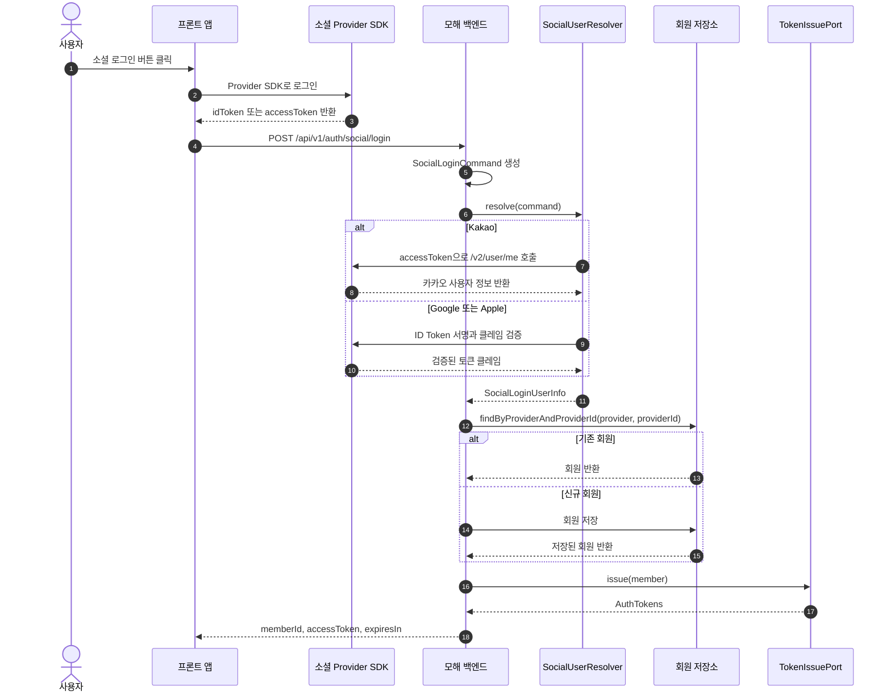

# 모해 백엔드

모해 백엔드 서비스입니다.

## 문서

- [소셜 로그인 구현 로드맵](docs/social-login-roadmap.md)

## 소셜 로그인 시퀀스



## Web Push

### Environment variables

```properties
WEB_PUSH_ENABLED=true
WEB_PUSH_SUBJECT=mailto:admin@example.com
WEB_PUSH_PUBLIC_KEY=your-vapid-public-key
WEB_PUSH_PRIVATE_KEY=your-vapid-private-key
NOTIFICATION_DEDUP_PREFIX=notification:dedup
NOTIFICATION_DEDUP_TTL_SECONDS=300
NOTIFICATION_OUTBOX_ENABLED=true
NOTIFICATION_OUTBOX_BATCH_SIZE=50
NOTIFICATION_OUTBOX_FIXED_DELAY_MILLIS=60000
DB_SCHEMA=mohae
BATCH_SCHEMA=mohae_backend_batch
SPRING_SQL_INIT_MODE=always
BATCH_DB_URL=jdbc:mysql://localhost:3306/${BATCH_SCHEMA}?createDatabaseIfNotExist=true&serverTimezone=Asia/Seoul&characterEncoding=UTF-8
BATCH_DB_USER_NAME=root
BATCH_DB_PASSWORD=change-me
```

### VAPID key generation

```bash
npx web-push generate-vapid-keys
```

### APIs

- `GET /api/v1/push-subscriptions/public-key`: returns the VAPID public key.
- `POST /api/v1/push-subscriptions`: registers or refreshes the current user's browser subscription.
- `DELETE /api/v1/push-subscriptions`: disables the current user's subscription by endpoint.
- `POST /api/v1/notifications/test`: enqueues a test Web Push notification to the current user.

### Service worker example

```js
self.addEventListener("push", (event) => {
  const payload = event.data ? event.data.json() : {};
  event.waitUntil(
    self.registration.showNotification(payload.title, {
      body: payload.body,
      data: payload.data || { linkUrl: payload.linkUrl },
    })
  );
});

self.addEventListener("notificationclick", (event) => {
  event.notification.close();
  const linkUrl = event.notification.data?.linkUrl || "/";
  event.waitUntil(clients.openWindow(linkUrl));
});
```

### Notes

- iOS Web Push requires an installed PWA and user permission. Browser support and permission UX differ by iOS version.
- `notification_target` stores Web Push subscriptions.
- `notification` stores requested notification messages.
- `notification_outbox` stores pending Web Push jobs for the scheduler.
- `notification_delivery` stores per-target send results.
- Spring Batch metadata tables use the `mohae_backend_batch` schema by default.
- `batch.datasource.*` connects to `mohae_backend_batch` and initializes Batch metadata tables from `db/batch-schema-mysql.sql`.
- `batch.datasource.*` is used only for Spring Batch metadata.
- Check Batch metadata with `show tables from mohae_backend_batch like 'BATCH_%';`.
- When Redis deduplication fails, sending continues and only a warning is logged.
